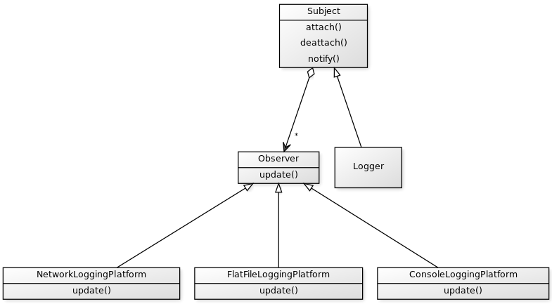

# LoggingCPP

Designing a Logging framework using Observer Design Pattern :

Console Platform:   It prints the message on console.

File Platform:   It writes the message in attached txt file.

Network Platform:   It forwards the message on network.

This is a example of Observer Design Pattern.

